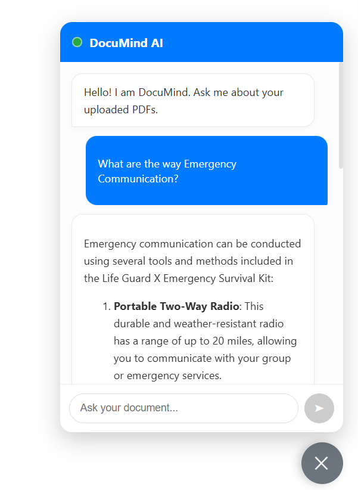

# DocuMindAI.Web

DocuMindAI.Web is the high-performance web application for the **DocuMind RAG ecosystem**.  
Built with **Angular 19**, it provides a seamless, ChatGPT-like interface for interacting with private document knowledge bases.  
The goal is to make document retrieval and AI-powered conversations intuitive, fast, and secure.

---

## 🚀 Features
- **ChatGPT-like UI** for document-based Q&A
- **Integration with RAG (Retrieval-Augmented Generation)** pipelines
- **Angular 19** frontend with modern architecture
- **Responsive design** for desktop and mobile
- **Scalable structure** for enterprise document management
- **Customizable knowledge base connections**

---

